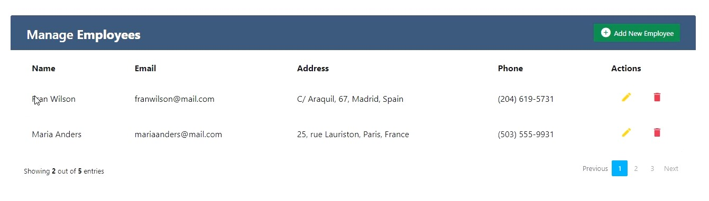
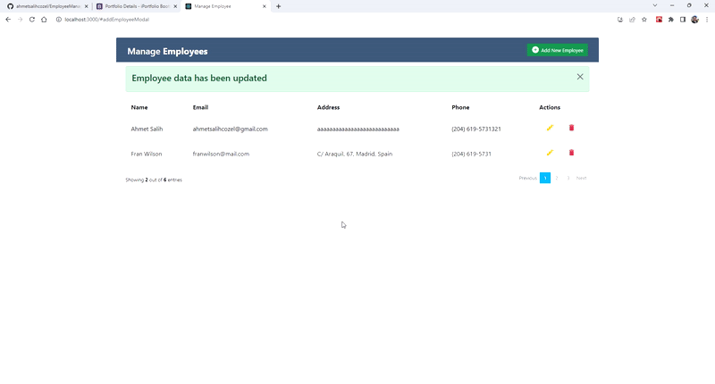
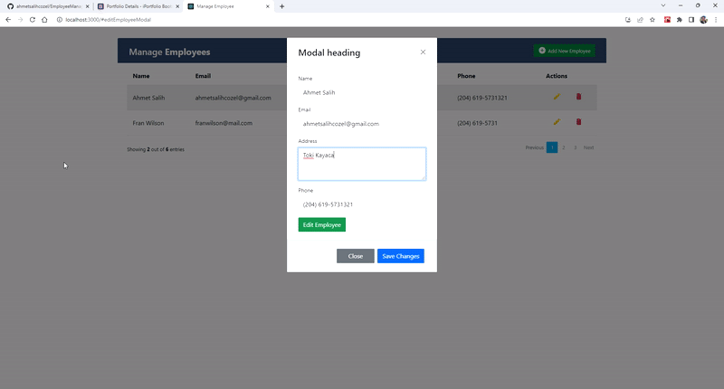
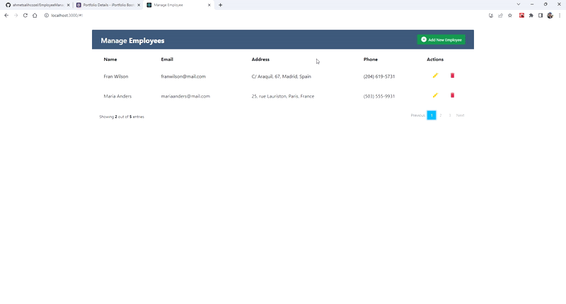
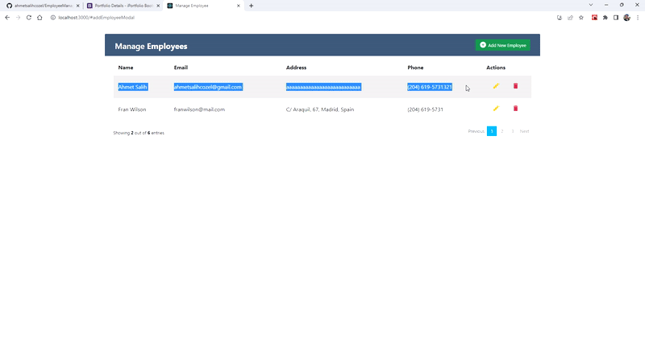

# Employee CRUD Uygulaması
 
EmployeeManagement.txt dosyası içerisinde bulunan React.js projesi kodları, bir çalışan yönetim sistemi web önyüzü tasarımı örneği oluşturmak ve React Context yapısını anlamak için alıştırma amaçlı yazılmıştır. Proje, aşağıdaki bileşenlerden oluşmaktadır:

## AddForm:
 
Yeni bir çalışan eklemek için bir form bileşeni. Formda ad, e-posta, adres ve telefon alanları bulunmaktadır. Form gönderildiğinde, EmployeeContext'ten alınan addEmployee fonksiyonu çalıştırılır ve yeni çalışan bilgileri state'e eklenir. Ayrıca formda useState ve useContext hook'ları kullanılmıştır.

## EditForm:
 
 Varolan bir çalışanın bilgilerini düzenlemek için bir form bileşeni. Formda aynı alanlar bulunmaktadır. Form gönderildiğinde, EmployeeContext'ten alınan updateEmployee fonksiyonu çalıştırılır ve güncellenmiş çalışan bilgileri state'e yansıtılır. Ayrıca formda useState ve useContext hook'ları kullanılmıştır.

## Employee:

 Bir çalışanın bilgilerini gösteren bir tablo satırı bileşeni. Tabloda ad, e-posta, adres, telefon ve işlem seçenekleri bulunmaktadır. İşlem seçenekleri arasında düzenle ve sil butonları vardır. Düzenle butonu tıklandığında, EditForm bileşeni bir modal içinde gösterilir. Sil butonu tıklandığında, EmployeeContext'ten alınan deleteEmployee fonksiyonu çalıştırılır ve seçilen çalışan state'den silinir. Ayrıca bileşende useEffect ve useContext hook'ları kullanılmıştır.

## EmployeeList:
 Tüm çalışanların listelendiği bir tablo bileşeni. Tabloda Employee bileşenleri yer almaktadır. Ayrıca tablonun başında yeni bir çalışan eklemek için AddForm bileşeni çağrılır. Tablonun altında ise Pagination bileşeni ile sayfalama işlemi yapılır. Bileşende useState, useEffect ve useContext hook'ları kullanılmıştır.

## Pagination:

 Tablodaki çalışan sayısına göre sayfalama yapmak için bir bileşen. Bileşende sayfa numaraları ve önceki/sonraki butonları bulunmaktadır. Bir sayfa numarası veya buton tıklandığında, setCurrentPage fonksiyonu ile state güncellenir ve EmployeeList bileşeni yeniden render edilir. Bileşende useState ve useEffect hook'ları kullanılmıştır.

## EmployeeContext:
 Tüm uygulama boyunca paylaşılan state ve fonksiyonları sağlayan bir context bileşeni. Bileşende employees adında bir state tanımlanmıştır ve bu state başlangıçta sabit veriler veya localStorage'den alınan veriler ile doldurulmuştur. Bileşende ayrıca addEmployee, deleteEmployee ve updateEmployee adında üç fonksiyon tanımlanmıştır ve bu fonksiyonlar employees state'ini değiştirmektedir. Bileşende createContext, useState ve useEffect hook'ları kullanılmıştır.

## App:
 Ana uygulama bileşeni. Bileşende EmployeesContextProvider ile EmployeeList bileşeni çağrılır.

Proje de React.js'in temel özelliklerinden olan JSX, hook, context, useState, useEffect, contextProvider, contextConsumer, ve component kavramları kullanılmıştır.

